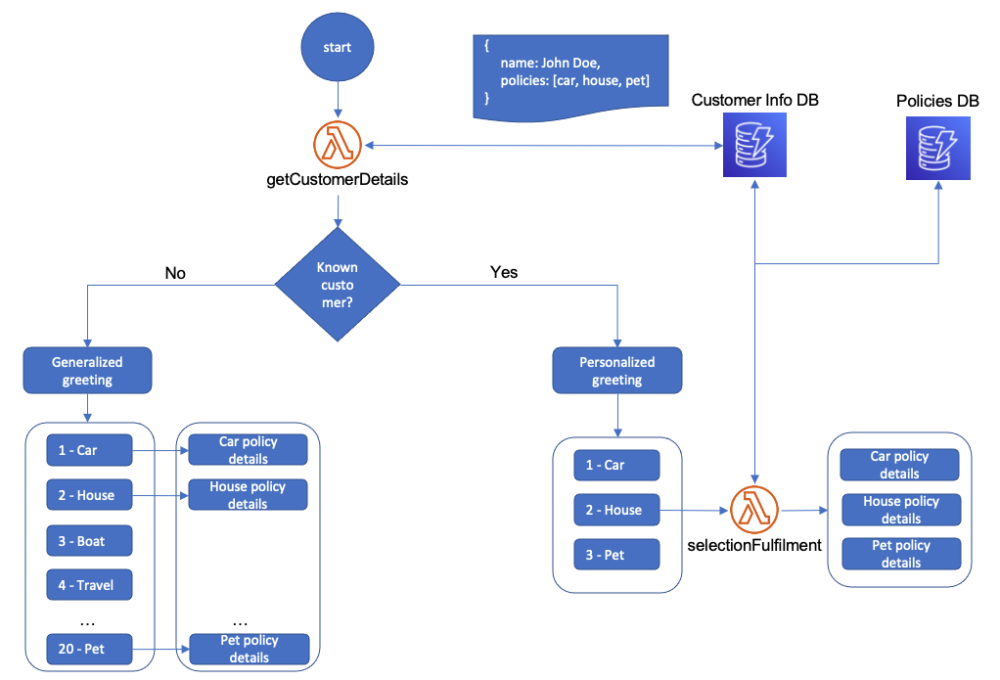

# Dynamic Menus in Amazon Connect
Example of a simple dynamic menu implementation in Amazon Connect using Amazon Lambda and Amazon DynamoDB

# Intro

Modern IVR systems help customers find answers to their questions by navigating a series or menus, usually relying on the customer to filter and select the right options.
Adding more options in these IVR menus and hoping to increase the rate of self-serviced calls can be tempting, but it can also overpower customers and lead them to “zeroing out” (i.e. selecting to speak to a human agent), defeating the purpose of the IVR. This code sample shows how to build a dynamic IVR menu based on Amazon Lambda and Amazon DynamoDB that can alleviate this problem, by providing each customer with a personalized list of menu options.

# Repo Navigation

* Resource provisioning in [cdk-app](cdk-app)
* Lambda code in [lambda](lambda)

# Flow Architecture

Imagine an insurance company providing a self service call center line for customers to check their policies. The insuance company offers dozens of policies, but wants to present only the relevant policies for active customers - minimizing call time and customer satisfaction.

We store the customer and menu options in a database and build the menu dynamically via a series of Lambda functions, based on user information. Consider a user with the following customer information stored in a database: phone number, name and active insurance policies. A dynamic menu implementation will authenticate the user based on phone number, retrieve the policy information from the database and build the menu options accordingly. 

The first Lambda function fetches the customer's active policies and builds the personalized greeting and menu selection prompt. A secondary Lambda function is used to map the customer's menu selection to the correct menu path. This is required as the menu is dynamic and the items and ordering are different for different customers. This approach also allows administators to add or change insurance types and their details directly in the database, without the need to update the IVR structure. This can be very powerful when maintaining IVR flows for 10s of products or services.

# Deployment Instructions

Step 1 (Optional) 
If you do not have a Connect instance, deploy one and claim a phone number using the getting started guide here:
https://docs.aws.amazon.com/connect/latest/adminguide/tutorial1-set-up-your-instance.html

Step 2
The resources required for this demo are packeged as a CDK app. To deploy the CDK app, navigate to the [cdk-app](cdk-app) and follow the steps there.

Step 3
Update your Connect instance settings to allow the invocation of the Lambda functions created by the CDK app.

    3.1 Log into the Amazon console.
    3.2 Navigate to Services > Amazon Connect. Select your Connect instance.
    3.3 Select Contact Flows
    3.4 Scroll down to the Lambda section and add the 'getCustomerDetails*' and 'selectionFulfilment*' functions. Make sure to click +Add Lambda Function.

Step 4
Import the demo flow.

    4.1 Download the 'DemoMenu' flow from the flow_archive section of this repository.
    4.2 Navigate to the Amazon Connect console. 
    4.3 Create a new contact flow by selecting 'Contact Flows' from the left side menu and then 'Create New Contact Flow'
    4.4 Select 'Import Flow(beta)' from the upper right corner and select the 'DemoMenu' file.
    4.5 Click on the first 'Invoke Lambda' block and make sure the 'getCustomerDetails*' Lambda is selected. 
    4.6 Click on the second 'Invoke Lambda' block and make sure the 'selectionFulfilment*' Lambda is selected. 
    4.7 Click Publish
    4.8 Associate the new flow with your claimed phone number. (Phone Numbers section in the left menu)

Step 5
For the demo to work and recognize your phone number, you will need to enter your phone number in the dummy 'customers' table.
    
    5.1 Navigate to the AWS conosle and select DynamoDB
    5.2 Under tables, open 'CdkAppStack-policiesDb*' table and go to the 'Items' tab
    5.3 Select one of the customers and select Actions > Duplicate. In the new item, enter your phone number in international format.
    5.4 Click Save

Step 6
Test. Dial your claimed number. You should hear the menu options built based on your database table entry.
